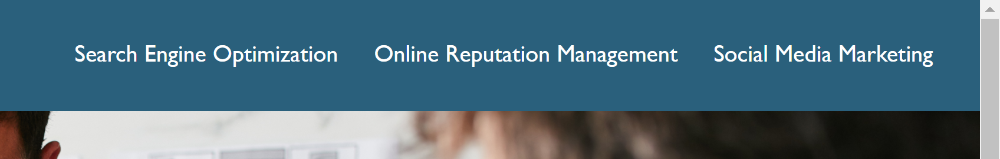

# Code Refactor (Homework-01): Horiseon Social Solution Services Webpage

## Description

This is an example webpage for a fake marketing company named Horiseon. It originally had generic HTML tags, redundant CSS, and no comments or image alt attributes. I changed each of the generic HTML tags to an appropriate semantic tag, optimized and updated the CSS to match the HTML, added descriptions to the images, and commented both documents.

This version of the webpage has better support for accessibility software, and is easier for developers to read and edit. It has comments describing the function of each part of both the HTML and CSS file.

This webpage is written in HTML and CSS.

[View the deployed webpage here.](https://johndjake.github.io/code-refactor-homework/)

## Usage

Navigate the webpage by scrolling or by clicking the navigation links in the top right corner of the webpage.

## Credits

The original version of this webpage was given to me by Trilogy Education Services as a homework assignment.

## License

The design of this webpage is copyrighted by Trilogy Education Services.